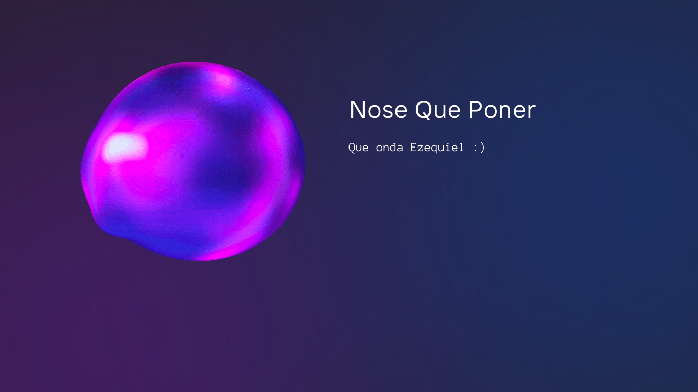

# paginademanu<!DOCTYPE html>
<html lang="es">
<head>
    <meta charset="UTF-8">
    <meta name="viewport" content="width=device-width, initial-scale=1.0">
    <title>Mi Página Web</title>
    
</head>
<body>
    
    
    
</body>
</html>

